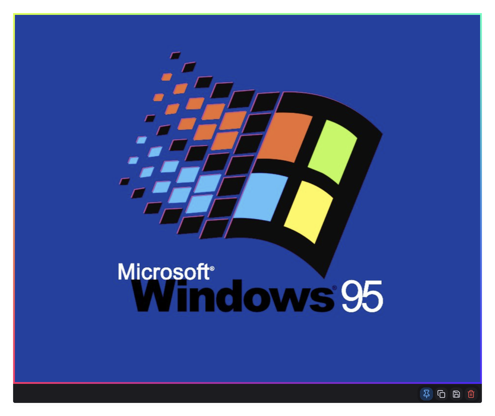

# MiniShot

Minimial MacOS screenshot tool in C.
Press a hotkey, drag-select a region, pin it, resize and drag around orcopy and save.



## Stack

SDL3 + SDL3_ttf (window, render, text), Clay (layout), stb_image (PNG load), the
macOS `screencapture` CLI, and Carbon for the system-wide capture hotkey (SDL key
events need window focus; a menu-bar agent has none).

## Inspirations

- [Snipaste](https://www.snipaste.com) — the capture-then-pin model: a screenshot becomes a floating window you keep on screen while you work.
- [CleanShot](https://cleanshot.com) — the bar for polish: the framed capture, the quick-action toolbar, the restrained motion. MiniShot aims at that finish with a fraction of the surface.

## Build

macOS only (Carbon and Cocoa ship with the OS). Clay, stb_image, and the Lucide
icon font are not committed; `build.sh` downloads them on first run, cached
thereafter (pinned by commit in the script's `*_SHA` variables).

```
brew install sdl3 sdl3_ttf   # the two library dependencies
./build.sh fetch             # download the third-party headers and font
./build.sh build             # fetch, configure, and build
./build.sh test              # fetch, build, and run unit tests
./build.sh run               # fetch, build, and launch the binary
./build.sh bundle            # package into MiniShot.app
```
